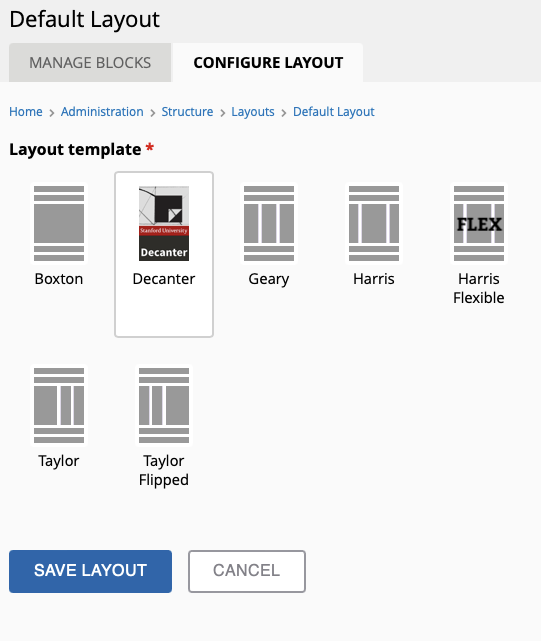
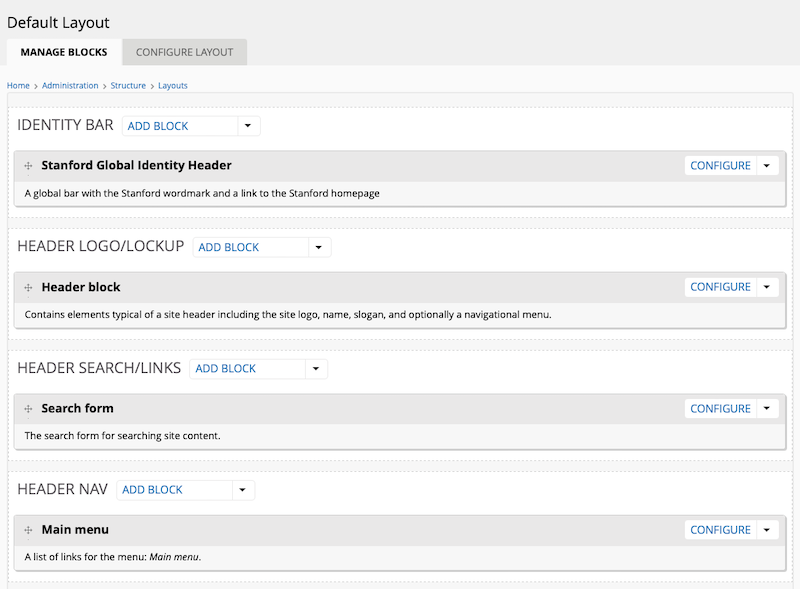

# Welcome to Stanford Decanter (v7) for Backdrop

The Stanford Decanter (v7) theme is a Backdrop CMS theme based on [Decanter v7](http://decanter.stanford.edu) and [Tailwind](https://tailwindcss.com).

The theme is designed to provide flexible out of the box experience to allow for the rapid creation of web properties that comply with the [Stanford Identity Guidelines](https://identity.stanford.edu).

## Installation and Configuration

The theme may be installed and enabled in the same manner as any other Backdrop Theme (https://docs.backdropcms.org/documentation/skin-with-themes).

Additional functionality can be added by installing the [Theme Hooks module](https://github.com/ronan/theme_hooks) including:

1. A custom layout with global header and footer and hero regions.
2. Default global header and footer blocks.

## Initial Set Up

Once you have enabled this theme along with the Theme Hooks module, a new layout option will appear on the layout config tab called `Decanter`. Choose this layout if you want a standardized layout with Stanford specific theming and functionality.

## Placing Standard Blocks

There is some flexibility as to where you can place blocks but for most sites, the following standard placement is recommended for Stanford Identity specific blocks:

- Place the *Stanford Global Identity Header* into the **Idenity Bar** region.
- Place the *Header block* into the **Header Logo/Lockup** region.
- Place the *Stanford Global Footer* into the **Stanford Footer** region
- (Optional) Place the *Search form* into the **Search/Links** region.
- (Optional) Place a menu block into the **Search/Links** region to act as the secondary header menu. This is a good spot for the user menu block.
- (Optional) Place the *Main menu* block into the **Header nav** region.

## More Documentation

Learn more about:

- [Developing the Theme](./development.md)
- [Additional Styles](./styles.md)
- [Creating and Managing Content](./content.md)

[Edit this page on Github](https://github.com/backdrop-contrib/stanford_decanter/edit/main/docs/intro.md)