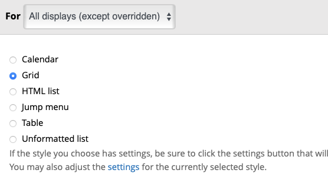
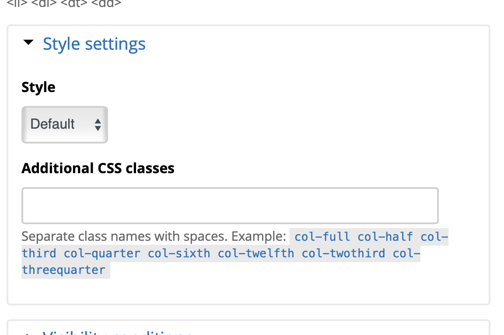

# Decanter (v7) Styles and Classes

Decanter 7 and tailwind come with a large number of css classes which can be used within the Backdrop admin interface to change the look of standard Backdrop elements to match the examples from the [Decanter Developer Site](https://decanter.stanford.edu/examples/cards)

## Cards

Cards are a standard way of displaying summary content. These cards may link to other content, to the detail view of the card content or may just be informational with no links at all. There are three standard card styles:

### Card Types

#### Plain

Plain cards are minimally adorned and best for simple information and links to content. Cards will automatically take this form or you can use the class `.plain`.

#### Bordered

Bordered cards have a moderate level of decoration and provide a more impactful visual for high criticality and news links. This style can be invoked with the `.bordered` class.

#### Dark

The dark or 'background' card has a dark background and contrasting text for the most visual impact. Use the `.dark` or `.background` class.

### Creating Cards with Paragraphs Aplenty

The [Paragraphs Aplenty module](https://backdropcms.org/project/paragraphs_aplenty) when combined with the [Paragraphs module](https://backdropcms.org/project/paragraphs) allow content authors to create cards using either the 'Card' or 'Cards' paragraph type.

### Creating Cards with Views

Coming soon

## Grids

Cards and other summary views are often displayed in grids. This theme uses the [Tailwind Grid system](https://tailwindcss.com/docs/grid-template-columns) along with some helper classes to create a 12 column grid. This allows grids and sections with 1, 2, 3, 4, 6 or 12 columns. These grids are responsive should collapse down on smaller screens.

### Creating a Grid with Views

The built in `Grid` views formatter works with the Decanter theme.

### Spanning Columns in a Grid.

Adding the following classes to a grid item or layout block will cause it to span across columns. This can be used to create complex layouts:

- `col-full`
- `col-half`
- `col-third`
- `col-quarter`
- `col-sixth`
- `col-twelfth`
- `col-twothird`
- `col-threequarter`

#### Spanning columns in the Decanter layout

If you are using the Decanter layout you can set the width of blocks in the Bottom and Footer regions.

By default, blocks will span 3 of 12 columns. To change this, open on the "Configure" dialog for the block and go to the `Style settings`:

Click one of the `col-*` links to add that class to the block.

For a visual reference of the `col-*` classes see [this example file](../examples/grid.html)

## Utility Styles

Some other useful utility styles include:

- `.cta`: Turn any link into a round sided Call to Action button
- `.btn`: Turn a link into a square submit button
- `.link-arrow`: Add an animated internal link arrow to a link
- `.ext-link`: Add an animated external link arrow.
- `.rs-grid`: Turn a layout region into a responsive 12 column grid. NB: The 'Page Bottom' and 'Local Footer' regions already have this style applied.
- `.hero`: Turn any block or content into a Hero block. You can also create hero blocks by using the default 'Hero' content type.

[Edit this page on Github](https://github.com/backdrop-contrib/stanford_decanter/edit/main/docs/styles.md)

## Responsive Breakpoints

- `xs`: 0 - 575px
- `sm`: 576 - 767px
- `md`: 768 - 991px
- `lg`: 992 - 1199px
- `xl`: 1200 - 1499px
- `2xl`: 1500px and up